# Bitácora de Implementación — Proyecto 13
## Proveedor de Hosting Web Compartido

**Universidad San Francisco Xavier de Chuquisaca — SIS313**

**Docente:** Ing. Marcelo Quispe Ortega

**Estudiantes:**

- Aguilar Rosales Carla Fátima
- Arancibia Flores Erick Manuel
- Avendaño Retamozo Juan Antonio
- Dávalos Núñez Gabriela

**Semestre:** 1/2026

**Fecha de implementación:** 2026-06-06

---

## Infraestructura

| VM | IP | Hostname | Rol |
|---|---|---|---|
| VM-1 | `192.168.100.151` | `proxy` | Proxy Inverso NGINX + Prometheus + Grafana |
| VM-2 | `192.168.100.152` | `hosting` | Servidor Web (NGINX + virtual hosts) |
| VM-3 | `192.168.100.153` | `db` | Base de Datos (MariaDB) |
| VM-4 | `192.168.100.154` | `dns` | DNS (BIND9) |
| VM-5 | `192.168.100.155` | `backup` | Backup (tar + cron + SSH) |

- **Red:** `192.168.100.0/24` | **Gateway:** `192.168.100.1` | **Interfaz:** `ens18`
- **Usuario:** `adming5`
- **Contraseña:** `4dm1ng5`
- **Acceso:** SSH vía jump host `usrproxy@201.131.45.42`

---

## Configuración del cliente SSH (PC local — Windows PowerShell)

Se configuró un jump host para acceder a las VMs con un solo comando:

```powershell
notepad "$env:USERPROFILE\.ssh\config"
```

Contenido del archivo `~/.ssh/config`:

```
# Proxy del datacenter USFX
Host bastion
    HostName 201.131.45.42
    User usrproxy

# VMs del Proyecto 13
Host proxy-vm
    HostName 192.168.100.151
    User adming5
    ProxyJump bastion

Host hosting
    HostName 192.168.100.152
    User adming5
    ProxyJump bastion

Host db
    HostName 192.168.100.153
    User adming5
    ProxyJump bastion

Host dns
    HostName 192.168.100.154
    User adming5
    ProxyJump bastion

Host backup
    HostName 192.168.100.155
    User adming5
    ProxyJump bastion
```

---

## Paso 1 — VM-4: Servidor DNS (192.168.100.154)

```powershell
ssh dns
```

### 1.1 Hostname y actualización

```bash
sudo hostnamectl set-hostname dns
sudo apt update && sudo apt upgrade -y
```

### 1.2 Instalación de BIND9

```bash
sudo apt install bind9 bind9utils -y
sudo systemctl enable bind9
```

### 1.3 Configuración de opciones de BIND9

```bash
sudo tee /etc/bind/named.conf.options > /dev/null << 'EOF'
options {
    directory "/var/cache/bind";

    forwarders {
        8.8.8.8;
        8.8.4.4;
    };
    forward only;

    allow-query     { 192.168.100.0/24; 127.0.0.1; };
    allow-recursion { 192.168.100.0/24; 127.0.0.1; };

    version "none";

    dnssec-validation auto;
    listen-on { 192.168.100.154; 127.0.0.1; };
};
EOF
```

### 1.4 Configuración de zonas

```bash
sudo mkdir -p /etc/bind/zones

sudo tee /etc/bind/named.conf.local > /dev/null << 'EOF'
zone "hosting.local" {
    type master;
    file "/etc/bind/zones/db.hosting.local";
    allow-query   { 192.168.100.0/24; 127.0.0.1; };
    allow-transfer { none; };
};

zone "100.168.192.in-addr.arpa" {
    type master;
    file "/etc/bind/zones/db.192.168.100";
    allow-query   { 192.168.100.0/24; 127.0.0.1; };
    allow-transfer { none; };
};
EOF
```

### 1.5 Archivos de zona

**Zona directa:**

```bash
sudo tee /etc/bind/zones/db.hosting.local > /dev/null << 'EOF'
$ORIGIN hosting.local.
$TTL 86400

@   IN  SOA  dns.hosting.local. admin.hosting.local. (
                2026060501
                3600
                900
                604800
                300
            )

@       IN  NS   dns.hosting.local.

proxy       IN  A   192.168.100.151
hosting     IN  A   192.168.100.152
db          IN  A   192.168.100.153
dns         IN  A   192.168.100.154
backup      IN  A   192.168.100.155

acmecorp            IN  A       192.168.100.151
www.acmecorp        IN  CNAME   acmecorp.hosting.local.

techsolutions       IN  A       192.168.100.151
www.techsolutions   IN  CNAME   techsolutions.hosting.local.

globalstore         IN  A       192.168.100.151
www.globalstore     IN  CNAME   globalstore.hosting.local.
EOF
```

**Zona inversa:**

```bash
sudo tee /etc/bind/zones/db.192.168.100 > /dev/null << 'EOF'
$ORIGIN 100.168.192.in-addr.arpa.
$TTL 86400

@   IN  SOA  dns.hosting.local. admin.hosting.local. (
                2026060501
                3600
                900
                604800
                300
            )

@   IN  NS   dns.hosting.local.

151  IN  PTR  proxy.hosting.local.
152  IN  PTR  hosting.hosting.local.
153  IN  PTR  db.hosting.local.
154  IN  PTR  dns.hosting.local.
155  IN  PTR  backup.hosting.local.
EOF
```

```bash
sudo chown -R bind:bind /etc/bind/zones/
```

### 1.6 Verificación y arranque

```bash
sudo named-checkconf
sudo named-checkzone hosting.local /etc/bind/zones/db.hosting.local
sudo named-checkzone 100.168.192.in-addr.arpa /etc/bind/zones/db.192.168.100
sudo systemctl restart bind9
```

**Resultado:** `zone hosting.local/IN: loaded serial 2026060501 — OK`

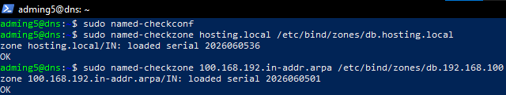

### 1.7 Prueba de resolución

```bash
dig @192.168.100.154 acmecorp.hosting.local
```

**Resultado:** `acmecorp.hosting.local. 86400 IN A 192.168.100.151`

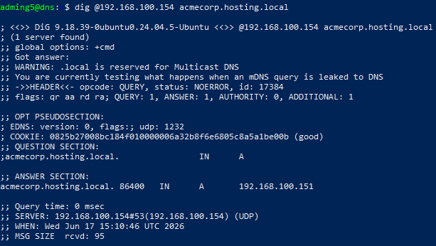

### 1.8 Firewall

```bash
sudo apt install ufw -y
sudo ufw default deny incoming
sudo ufw default allow outgoing
sudo ufw allow from 192.168.100.0/24 to any port 53  comment "DNS interno"
sudo ufw allow from 192.168.100.0/24 to any port 22  comment "SSH"
sudo ufw allow from 192.168.100.0/24 to any port 9100 comment "node_exporter"
sudo ufw --force enable
```

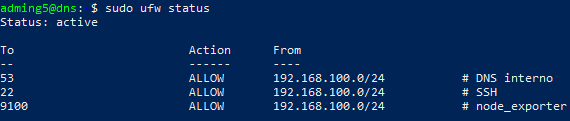

### 1.9 Node Exporter

```bash
sudo apt install prometheus-node-exporter -y
sudo systemctl enable --now prometheus-node-exporter
```

### 1.10 Hostname en /etc/hosts

```bash
echo "127.0.0.1 dns" | sudo tee -a /etc/hosts
```

### 1.11 DNS en /etc/resolv.conf

```bash
sudo nano /etc/resolv.conf
# Contenido:
# nameserver 192.168.100.154
# nameserver 8.8.8.8
```

---

## Paso 2 — VM-2: Servidor Hosting (192.168.100.152)

```powershell
ssh hosting
```

### 2.1 Hostname y actualización

```bash
sudo hostnamectl set-hostname hosting
sudo apt update && sudo apt upgrade -y
```

### 2.2 Instalación de NGINX y quota

```bash
sudo apt install nginx quota -y
sudo systemctl enable nginx
```

### 2.3 Estructura base

```bash
sudo groupadd --system www-hosting
sudo usermod -aG www-hosting www-data
sudo mkdir -p /var/www/hosting
sudo mkdir -p /var/log/nginx/clients
sudo mkdir -p /var/backups/hosting
sudo mkdir -p /var/lib/hosting
sudo chmod 711 /var/www/hosting
```

### 2.4 Instalación de scripts

Desde PowerShell en la PC local:

```powershell
scp -J bastion scripts/create_client.sh adming5@192.168.100.152:/tmp/
scp -J bastion scripts/backup_client.sh adming5@192.168.100.152:/tmp/
scp -J bastion scripts/hosting_menu.sh  adming5@192.168.100.152:/tmp/
```

En la VM hosting:

```bash
sudo mkdir -p /opt/hosting/scripts
sudo mv /tmp/create_client.sh /opt/hosting/scripts/
sudo mv /tmp/backup_client.sh /opt/hosting/scripts/
sudo mv /tmp/hosting_menu.sh  /opt/hosting/scripts/
sudo chmod +x /opt/hosting/scripts/*.sh
```

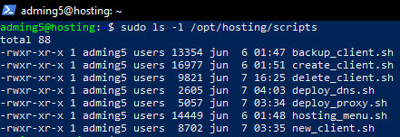

Se corrigió el script `create_client.sh` para compatibilidad con `useradd`:

```bash
sudo sed -i 's/--comment "Hosting: \$client"/--comment "Hosting-\$client"/' \
    /opt/hosting/scripts/create_client.sh
```

### 2.5 Usuario para el agente de backup

```bash
sudo useradd --system --no-create-home \
    --shell /bin/bash \
    --comment "Agente de backup" \
    backupagent
sudo mkdir -p /home/backupagent/.ssh
sudo chown -R backupagent:backupagent /home/backupagent
sudo chmod 700 /home/backupagent/.ssh
sudo usermod -aG www-hosting backupagent
```

### 2.6 Configuración de NGINX

```bash
sudo rm -f /etc/nginx/sites-enabled/default

sudo tee /etc/nginx/conf.d/hosting.conf > /dev/null << 'EOF'
server_tokens off;
limit_req_zone $binary_remote_addr zone=hosting:10m rate=20r/s;
EOF
```

### 2.7 Creación de los tres clientes

```bash
sudo bash /opt/hosting/scripts/create_client.sh acmecorp      acmecorp.hosting.local      500
sudo bash /opt/hosting/scripts/create_client.sh techsolutions techsolutions.hosting.local 750
sudo bash /opt/hosting/scripts/create_client.sh globalstore   globalstore.hosting.local   600
```

Cada ejecución creó automáticamente:
- Usuario del sistema `web_<cliente>` (sin shell, sin home)
- Directorios con permisos estrictos (750/755/700)
- Página HTML de bienvenida
- Virtual host NGINX con logs separados por cliente
- Configuración de logrotate (30 días, comprimido)
- Regla iptables de aislamiento por UID

### 2.8 Permisos del directorio base para backup

```bash
sudo chown root:www-hosting /var/www/hosting/
sudo chmod 750 /var/www/hosting/
```

### 2.9 Permisos sudo para backupagent

```bash
sudo tee /etc/sudoers.d/backupagent > /dev/null << 'EOF'
backupagent ALL=(ALL) NOPASSWD: ALL
EOF
sudo chmod 440 /etc/sudoers.d/backupagent
sudo visudo -c
```

### 2.10 Firewall

```bash
sudo apt install ufw -y
sudo ufw default deny incoming
sudo ufw default allow outgoing
sudo ufw allow from 192.168.100.151 to any port 80   comment "HTTP desde Proxy"
sudo ufw allow from 192.168.100.0/24 to any port 22  comment "SSH"
sudo ufw allow from 192.168.100.151 to any port 9100 comment "node_exporter"
sudo ufw --force enable
```

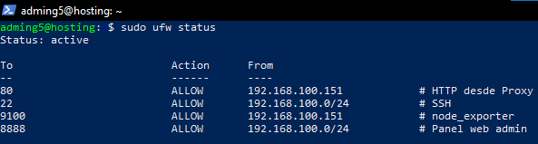

### 2.11 Node Exporter

```bash
sudo apt install prometheus-node-exporter -y
sudo systemctl enable --now prometheus-node-exporter
```

### 2.12 Quotas de disco

```bash
sudo nano /etc/fstab
# Añadir 'usrquota' a la entrada de la partición raíz:
# /dev/disk/by-id/dm-uuid-LVM-... / ext4 defaults,usrquota 0 1

sudo mount -o remount /
sudo quotacheck -cum /
sudo quotaon /

sudo setquota -u web_acmecorp      512000 614400 0 0 /
sudo setquota -u web_techsolutions 768000 921600 0 0 /
sudo setquota -u web_globalstore   614400 737280 0 0 /
```

**Verificación:**

```bash
sudo repquota -u / | grep web_
```

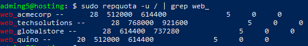

### 2.13 Hostname en /etc/hosts y DNS

```bash
echo "127.0.0.1 hosting" | sudo tee -a /etc/hosts
sudo nano /etc/resolv.conf
# nameserver 192.168.100.154
# nameserver 8.8.8.8
```

---

## Paso 3 — VM-1: Proxy Inverso + Monitoreo (192.168.100.151)

```powershell
ssh proxy-vm
```

### 3.1 Hostname y actualización

```bash
sudo hostnamectl set-hostname proxy
sudo apt update && sudo apt upgrade -y
```

### 3.2 Instalación y configuración de NGINX

```bash
sudo apt install nginx -y
sudo systemctl enable nginx
sudo rm -f /etc/nginx/sites-enabled/default
sudo mkdir -p /var/log/nginx/clients
```

### 3.3 Configuración del proxy inverso

```bash
sudo tee /etc/nginx/sites-available/hosting-proxy.conf > /dev/null << 'EOF'
upstream hosting_backend {
    server 192.168.100.152:80;
    keepalive 16;
}

server {
    listen 80;
    server_name acmecorp.hosting.local www.acmecorp.hosting.local;
    access_log /var/log/nginx/clients/acmecorp_proxy.log;
    error_log  /var/log/nginx/clients/acmecorp_proxy_error.log warn;
    server_tokens off;
    location / {
        proxy_pass         http://hosting_backend;
        proxy_set_header   Host              $host;
        proxy_set_header   X-Real-IP         $remote_addr;
        proxy_set_header   X-Forwarded-For   $proxy_add_x_forwarded_for;
        proxy_set_header   X-Forwarded-Proto $scheme;
        proxy_connect_timeout 10s;
        proxy_read_timeout    30s;
    }
    location ~ /\. { deny all; }
}

server {
    listen 80;
    server_name techsolutions.hosting.local www.techsolutions.hosting.local;
    access_log /var/log/nginx/clients/techsolutions_proxy.log;
    error_log  /var/log/nginx/clients/techsolutions_proxy_error.log warn;
    server_tokens off;
    location / {
        proxy_pass         http://hosting_backend;
        proxy_set_header   Host              $host;
        proxy_set_header   X-Real-IP         $remote_addr;
        proxy_set_header   X-Forwarded-For   $proxy_add_x_forwarded_for;
        proxy_set_header   X-Forwarded-Proto $scheme;
        proxy_connect_timeout 10s;
        proxy_read_timeout    30s;
    }
    location ~ /\. { deny all; }
}

server {
    listen 80;
    server_name globalstore.hosting.local www.globalstore.hosting.local;
    access_log /var/log/nginx/clients/globalstore_proxy.log;
    error_log  /var/log/nginx/clients/globalstore_proxy_error.log warn;
    server_tokens off;
    location / {
        proxy_pass         http://hosting_backend;
        proxy_set_header   Host              $host;
        proxy_set_header   X-Real-IP         $remote_addr;
        proxy_set_header   X-Forwarded-For   $proxy_add_x_forwarded_for;
        proxy_set_header   X-Forwarded-Proto $scheme;
        proxy_connect_timeout 10s;
        proxy_read_timeout    30s;
    }
    location ~ /\. { deny all; }
}

server {
    listen 8080;
    server_name _;
    allow 192.168.100.0/24;
    deny  all;
    location /nginx_status {
        stub_status;
        access_log off;
    }
}
EOF

sudo ln -s /etc/nginx/sites-available/hosting-proxy.conf \
           /etc/nginx/sites-enabled/hosting-proxy.conf
sudo nginx -t && sudo systemctl reload nginx
```

### 3.4 Instalación de Prometheus y Node Exporter

```bash
sudo apt install prometheus prometheus-node-exporter -y

sudo tee /etc/prometheus/prometheus.yml > /dev/null << 'EOF'
global:
  scrape_interval:     15s
  evaluation_interval: 15s
  external_labels:
    cluster: 'hosting-sis313'

scrape_configs:
  - job_name: 'prometheus'
    static_configs:
      - targets: ['localhost:9090']
        labels:
          vm: 'proxy'

  - job_name: 'node-proxy'
    static_configs:
      - targets: ['192.168.100.151:9100']
        labels:
          vm: 'proxy'

  - job_name: 'node-hosting'
    static_configs:
      - targets: ['192.168.100.152:9100']
        labels:
          vm: 'hosting'

  - job_name: 'node-dns'
    static_configs:
      - targets: ['192.168.100.154:9100']
        labels:
          vm: 'dns'

  - job_name: 'node-db'
    static_configs:
      - targets: ['192.168.100.153:9100']
        labels:
          vm: 'db'

  - job_name: 'node-backup'
    static_configs:
      - targets: ['192.168.100.155:9100']
        labels:
          vm: 'backup'
EOF

sudo systemctl restart prometheus
sudo systemctl enable prometheus
```

### 3.5 Instalación de Grafana

```bash
sudo apt install -y apt-transport-https software-properties-common wget
sudo mkdir -p /etc/apt/keyrings/
wget -q -O - https://apt.grafana.com/gpg.key | gpg --dearmor | \
    sudo tee /etc/apt/keyrings/grafana.gpg > /dev/null
echo "deb [signed-by=/etc/apt/keyrings/grafana.gpg] https://apt.grafana.com stable main" | \
    sudo tee /etc/apt/sources.list.d/grafana.list
sudo apt update && sudo apt install grafana -y
sudo systemctl enable --now grafana-server
```

### 3.6 Firewall

```bash
sudo apt install ufw -y
sudo ufw default deny incoming
sudo ufw default allow outgoing
sudo ufw allow 80/tcp                                          comment "HTTP publico"
sudo ufw allow 3000/tcp                                        comment "Grafana"
sudo ufw allow from 192.168.100.0/24 to any port 22   comment "SSH"
sudo ufw allow from 192.168.100.0/24 to any port 9090 comment "Prometheus"
sudo ufw allow from 192.168.100.0/24 to any port 8080 comment "nginx_status"
sudo ufw --force enable
```

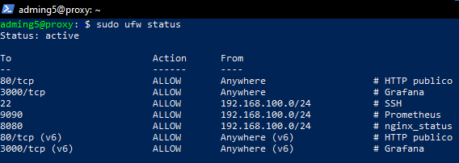

### 3.7 Hostname en /etc/hosts y DNS

```bash
echo "127.0.0.1 proxy" | sudo tee -a /etc/hosts
sudo nano /etc/resolv.conf
# nameserver 192.168.100.154
# nameserver 8.8.8.8
```

### 3.8 Configuración de Grafana

Acceso vía túnel SSH desde la PC local:

```powershell
ssh -L 3000:192.168.100.151:3000 -N bastion
```

URL: `http://localhost:3000` (credenciales iniciales: `admin` / `admin`)

- **Data source:** Prometheus → URL `http://localhost:9090` → Save & test
- **Dashboard importado:** Node Exporter Full (ID: `1860`)

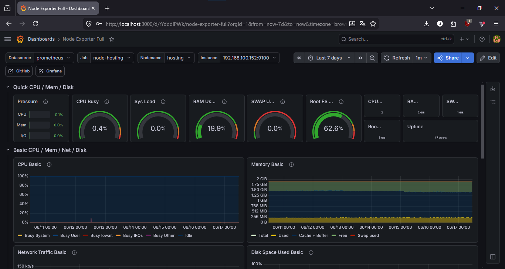

---

## Paso 4 — VM-5: Servidor de Backup (192.168.100.155)

```powershell
ssh backup
```

### 4.1 Hostname y actualización

```bash
sudo hostnamectl set-hostname backup
sudo apt update && sudo apt upgrade -y
```

### 4.2 Estructura de directorios

```bash
sudo mkdir -p /var/backups/hosting
sudo mkdir -p /opt/backup
```

### 4.3 Instalación del script de backup

Desde PowerShell en la PC local:

```powershell
scp -J bastion scripts/backup_client.sh adming5@192.168.100.155:/tmp/
```

En la VM backup:

```bash
sudo mv /tmp/backup_client.sh /opt/backup/
sudo chmod +x /opt/backup/backup_client.sh
```

Se corrigió el bloque de extracción remota añadiendo `-n` a los comandos `sudo` para evitar que queden esperando contraseña interactiva:

```bash
sudo nano /opt/backup/backup_client.sh
# Cambiar todos los 'sudo' del bloque ssh_run de restore por 'sudo -n'
```

### 4.4 Configuración de SSH sin contraseña hacia VM Hosting

```bash
sudo ssh-keygen -t ed25519 -C "backup@sis313" -f /root/.ssh/id_backup -N ""
sudo ssh-copy-id -i /root/.ssh/id_backup.pub backupagent@192.168.100.152
```

Verificación:

```bash
sudo ssh -i /root/.ssh/id_backup backupagent@192.168.100.152 "hostname"
# Resultado: hosting
```

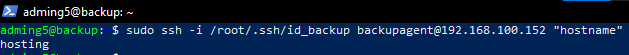

### 4.5 Cron para backup automático

```bash
sudo crontab -e
```

Líneas añadidas:

```
0 2 * * * bash /opt/backup/backup_client.sh all >> /var/log/hosting-backup.log 2>&1
0 3 * * 0 sudo ssh -i /root/.ssh/id_backup backupagent@192.168.100.152 "sudo logrotate -f /etc/logrotate.d/hosting-*" >> /var/log/logrotate-remote.log 2>&1
```

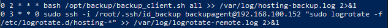

### 4.6 Firewall y Node Exporter

```bash
sudo apt install ufw -y
sudo ufw default deny incoming
sudo ufw default allow outgoing
sudo ufw allow from 192.168.100.0/24 to any port 22   comment "SSH"
sudo ufw allow from 192.168.100.151  to any port 9100 comment "node_exporter"
sudo ufw --force enable

sudo apt install prometheus-node-exporter -y
sudo systemctl enable --now prometheus-node-exporter
```

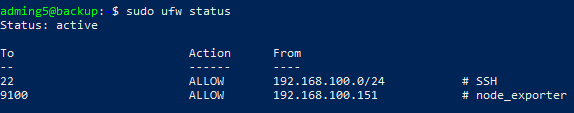

### 4.7 Hostname en /etc/hosts y DNS

```bash
echo "127.0.0.1 backup" | sudo tee -a /etc/hosts
sudo nano /etc/resolv.conf
# nameserver 192.168.100.154
# nameserver 8.8.8.8
```

---

## Paso 5 — VM-3: Base de Datos (192.168.100.153)

```powershell
ssh db
```

### 5.1 Hostname y actualización

```bash
sudo hostnamectl set-hostname db
sudo apt update && sudo apt upgrade -y
```

### 5.2 Instalación de MariaDB

```bash
sudo apt install mariadb-server -y
sudo systemctl enable mariadb
sudo mysql_secure_installation
```

### 5.3 Configuración de acceso remoto

```bash
sudo nano /etc/mysql/mariadb.conf.d/50-server.cnf
# Cambiar: bind-address = 127.0.0.1
# Por:     bind-address = 192.168.100.153

sudo systemctl restart mariadb
```

### 5.4 Firewall y Node Exporter

```bash
sudo apt install ufw -y
sudo ufw default deny incoming
sudo ufw default allow outgoing
sudo ufw allow from 192.168.100.152 to any port 3306 comment "MariaDB desde Hosting"
sudo ufw allow from 192.168.100.0/24 to any port 22  comment "SSH"
sudo ufw allow from 192.168.100.151  to any port 9100 comment "node_exporter"
sudo ufw --force enable

sudo apt install prometheus-node-exporter -y
sudo systemctl enable --now prometheus-node-exporter
```

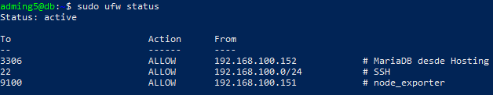

### 5.5 Hostname en /etc/hosts y DNS

```bash
echo "127.0.0.1 db" | sudo tee -a /etc/hosts
sudo nano /etc/resolv.conf
# nameserver 192.168.100.154
# nameserver 8.8.8.8
```

---

## Verificación final

Ejecutado desde la VM proxy:

```bash
# DNS
dig @192.168.100.154 acmecorp.hosting.local +short      # → 192.168.100.151
dig @192.168.100.154 techsolutions.hosting.local +short  # → 192.168.100.151
dig @192.168.100.154 globalstore.hosting.local +short    # → 192.168.100.151

# Sitios web por nombre de dominio
curl -s http://acmecorp.hosting.local | grep "<title>"
curl -s http://techsolutions.hosting.local | grep "<title>"
curl -s http://globalstore.hosting.local | grep "<title>"

# Prometheus targets
curl -s http://localhost:9090/api/v1/targets | python3 -m json.tool \
    | grep -E '"health"|"job"'
```

**Resultados:**

```
=== DNS ===
192.168.100.151
192.168.100.151
192.168.100.151

=== SITIOS WEB ===
<title>acmecorp.hosting.local — SIS313 Hosting</title>
<title>techsolutions.hosting.local — SIS313 Hosting</title>
<title>globalstore.hosting.local — SIS313 Hosting</title>

=== PROMETHEUS ===
node-backup   → health: up
node-db       → health: up
node-dns      → health: up
node-hosting  → health: up
node-proxy    → health: up
prometheus    → health: up
```

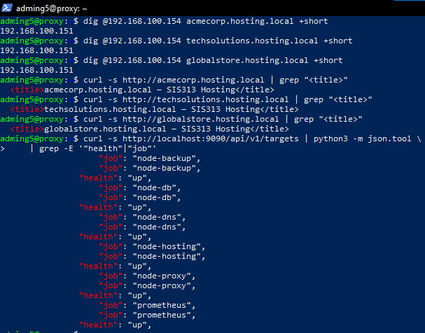

---

## Demostración de backup y restauración

**Backup manual de los tres clientes (desde VM backup):**

```bash
sudo bash /opt/backup/backup_client.sh backup acmecorp
sudo bash /opt/backup/backup_client.sh backup techsolutions
sudo bash /opt/backup/backup_client.sh backup globalstore
```

**Simulación de pérdida de datos (desde VM hosting):**

```bash
sudo rm /var/www/hosting/acmecorp/public_html/index.html
curl -s http://localhost -H "Host: acmecorp.hosting.local" | head -3
# → 403 Forbidden (sitio caído)
```

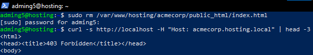

**Restauración (desde VM backup):**

```bash
sudo bash /opt/backup/backup_client.sh restore acmecorp
# Escribe: CONFIRMAR
```

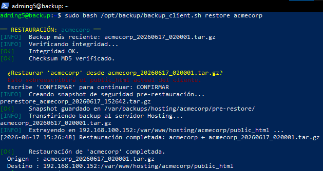

**Verificación post-restauración (desde VM hosting):**

```bash
curl -s http://localhost -H "Host: acmecorp.hosting.local" | grep "<title>"
# → <title>acmecorp.hosting.local — SIS313 Hosting</title>
```

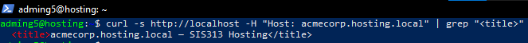

---

## Quotas de disco aplicadas

| Cliente | Usuario | Soft limit | Hard limit |
|---|---|---|---|
| acmecorp | web_acmecorp | 500 MB | 600 MB |
| techsolutions | web_techsolutions | 750 MB | 900 MB |
| globalstore | web_globalstore | 600 MB | 720 MB |

Verificación:

```bash
sudo repquota -u / | grep web_
```


---

## Actualizaciones y Correcciones

**Fecha:** 2026-06-07 al 2026-06-12

---

### A1. Scripts nuevos — Automatización completa del ciclo de vida de clientes

Se desarrollaron cuatro scripts adicionales que complementan el `create_client.sh` original, permitiendo gestionar el ciclo de vida completo de un cliente desde la VM Hosting:

#### `deploy_dns.sh` — VM Hosting → VM DNS (192.168.100.154)

Propaga el registro DNS de un nuevo cliente al servidor BIND9 vía SSH:

1. Verifica conectividad SSH hacia VM DNS
2. Comprueba que el registro no exista ya (idempotente)
3. Incrementa el serial del SOA
4. Construye el fragmento DNS localmente y lo transfiere vía `scp` para evitar problemas de caracteres especiales en heredocs remotos
5. Ejecuta `sudo named-checkzone` para verificar sintaxis antes de aplicar
6. Recarga BIND9 con `sudo rndc reload`
7. Verifica la resolución con `dig`

```bash
bash /opt/hosting/scripts/deploy_dns.sh <cliente> <dominio>
```

#### `deploy_proxy.sh` — VM Hosting → VM Proxy (192.168.100.151)

Crea el virtual host del cliente en el Proxy Inverso vía SSH:

1. Verifica conectividad SSH hacia VM Proxy
2. Comprueba que el vhost no exista ya (idempotente)
3. Crea `/etc/nginx/sites-available/<dominio>.conf` vía heredoc remoto
4. Enlaza en `sites-enabled/`
5. Verifica sintaxis con `sudo nginx -t`
6. Recarga NGINX con `sudo systemctl reload nginx`
7. Verifica que el sitio responde con `curl`

```bash
bash /opt/hosting/scripts/deploy_proxy.sh <cliente> <dominio>
```

#### `new_client.sh` — Orquestador completo

Script maestro que ejecuta los 4 pasos del ciclo de creación en secuencia, desde la VM Hosting:

```
[1/4] create_client.sh   → local (VM Hosting)        ← bloqueante
[2/4] deploy_dns.sh      → SSH hacia VM DNS           ← no bloqueante
[3/4] deploy_proxy.sh    → SSH hacia VM Proxy         ← no bloqueante
[4/4] backup_client.sh   → SSH hacia VM Backup        ← no bloqueante
```

```bash
sudo bash /opt/hosting/scripts/new_client.sh <cliente> <dominio> <quota_mb>
# Tiempo estimado: ~8 segundos
```

#### `delete_client.sh` — Eliminación completa de un cliente

Script monolítico que elimina un cliente de las 3 VMs mediante funciones helper `ssh_proxy()` y `ssh_dns()`:

```
[1/4] Local (Hosting)  → rm vhost, rm directorios, userdel, sed registry
[2/4] ssh_proxy        → rm vhost + nginx reload
[3/4] ssh_dns          → sed zona + named-checkzone + rndc reload
[4/4] Nota informativa → los backups en VM Backup se conservan
```

Acepta el nombre del cliente como segundo argumento para ejecución no interactiva desde el panel web.

```bash
sudo bash /opt/hosting/scripts/delete_client.sh <cliente>
```

#### Configuración SSH requerida

```bash
# Generar clave en VM Hosting
ssh-keygen -t ed25519 -C "hosting@sis313" -f ~/.ssh/id_hosting -N ""

# Copiar clave a VM Proxy y VM DNS
ssh-copy-id -i ~/.ssh/id_hosting.pub adming5@192.168.100.151
ssh-copy-id -i ~/.ssh/id_hosting.pub adming5@192.168.100.154

# Sudo sin contraseña en VM DNS y VM Proxy
echo "adming5 ALL=(ALL) NOPASSWD: ALL" | sudo tee /etc/sudoers.d/adming5-dns
echo "adming5 ALL=(ALL) NOPASSWD: ALL" | sudo tee /etc/sudoers.d/adming5-proxy
sudo chmod 440 /etc/sudoers.d/adming5-dns /etc/sudoers.d/adming5-proxy
```

---

### A2. Panel Web de Administración (Flask)

Panel web instalado en VM Hosting, accesible mediante túnel SSH en el puerto 8888.

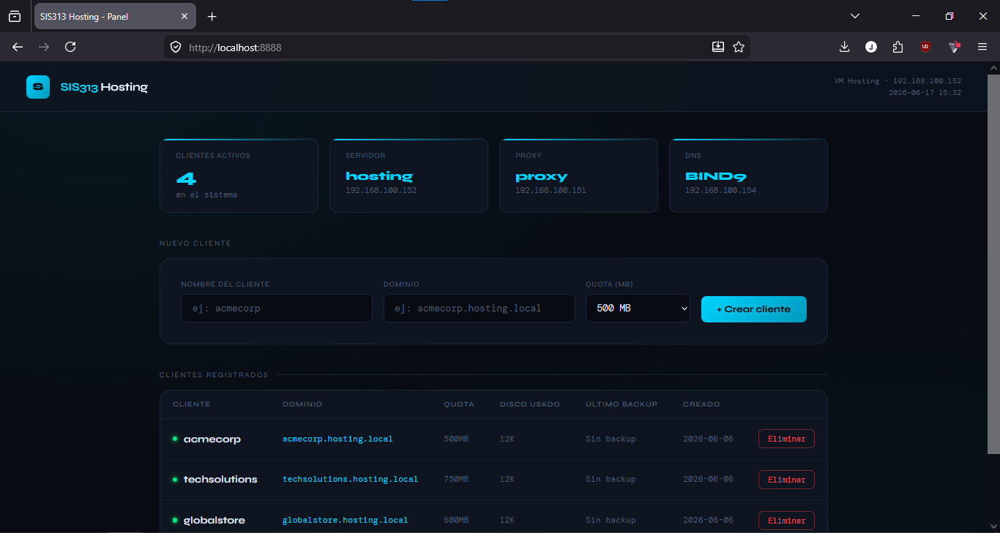

#### Instalación

```bash
sudo apt install python3-flask -y
sudo mkdir -p /opt/hosting/panel
# panel.py copiado a /opt/hosting/panel/
```

#### Servicio systemd

```bash
sudo tee /etc/systemd/system/hosting-panel.service > /dev/null << 'EOF'
[Unit]
Description=SIS313 Hosting Panel Web
After=network.target

[Service]
Type=simple
User=root
WorkingDirectory=/opt/hosting/panel
ExecStart=/usr/bin/python3 /opt/hosting/panel/panel.py
Restart=always
RestartSec=5

[Install]
WantedBy=multi-user.target
EOF

sudo systemctl daemon-reload
sudo systemctl enable --now hosting-panel
```

#### Funcionalidades

- **Crear cliente:** formulario (nombre, dominio, quota) → llama a `new_client.sh` → salida coloreada en tiempo real
- **Eliminar cliente:** botón por fila con modal de confirmación → llama a `delete_client.sh`
- **Tabla de clientes:** nombre, dominio, quota, disco usado, último backup, fecha de creación
- **Stats:** contador de clientes activos, IPs de infraestructura

#### Acceso

```powershell
# Túnel SSH desde PC local:
ssh -L 8888:192.168.100.152:8888 -N bastion
# Navegador: http://localhost:8888
```

#### Configuración adicional

```bash
# Sudo para que Flask ejecute los scripts como root
echo "www-data ALL=(ALL) NOPASSWD: /bin/bash /opt/hosting/scripts/new_client.sh" | \
    sudo tee /etc/sudoers.d/panel
sudo chmod 440 /etc/sudoers.d/panel

# UFW: puerto 8888 accesible desde red interna
sudo ufw allow from 192.168.100.0/24 to any port 8888 comment "Panel web admin"
```

---

### A3. Migración de virtual hosts en VM Proxy — un archivo por cliente

#### Situación original

Los 3 clientes originales estaban definidos en un único archivo `hosting-proxy.conf`, mientras que los clientes nuevos creados con `deploy_proxy.sh` generaban archivos individuales — inconsistencia corregida.

#### Solución aplicada

```bash
# 1. Upstream en archivo independiente (000- garantiza carga primero)
sudo tee /etc/nginx/sites-available/000-upstream.conf > /dev/null << 'EOF'
upstream hosting_backend {
    server 192.168.100.152:80;
    keepalive 16;
}
EOF
sudo ln -s /etc/nginx/sites-available/000-upstream.conf \
           /etc/nginx/sites-enabled/000-upstream.conf

# 2. hosting-proxy.conf reducido a solo nginx_status (puerto 8080)

# 3. Un archivo por cada cliente original
for cliente in acmecorp techsolutions globalstore; do
    # Crear /etc/nginx/sites-available/${cliente}.hosting.local.conf
    sudo ln -s /etc/nginx/sites-available/${cliente}.hosting.local.conf \
               /etc/nginx/sites-enabled/${cliente}.hosting.local.conf
done
sudo nginx -t && sudo systemctl reload nginx
```

#### Resultado final en `/etc/nginx/sites-enabled/` (VM Proxy)

```
000-upstream.conf                ← upstream hosting_backend (carga primero)
acmecorp.hosting.local.conf      ← vhost cliente 1
globalstore.hosting.local.conf   ← vhost cliente 2
hosting-proxy.conf               ← nginx_status (puerto 8080)
techsolutions.hosting.local.conf ← vhost cliente 3
```

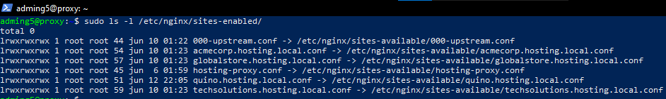

Todos los clientes (originales y nuevos) usan ahora el mismo formato — un archivo por sitio, habilitado/deshabilitado individualmente sin afectar a los demás.
